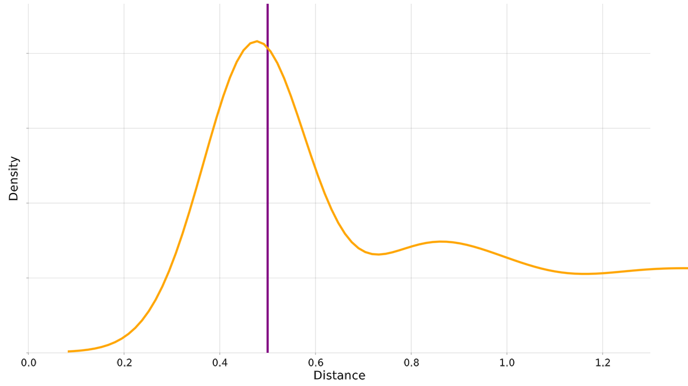
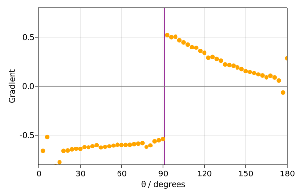
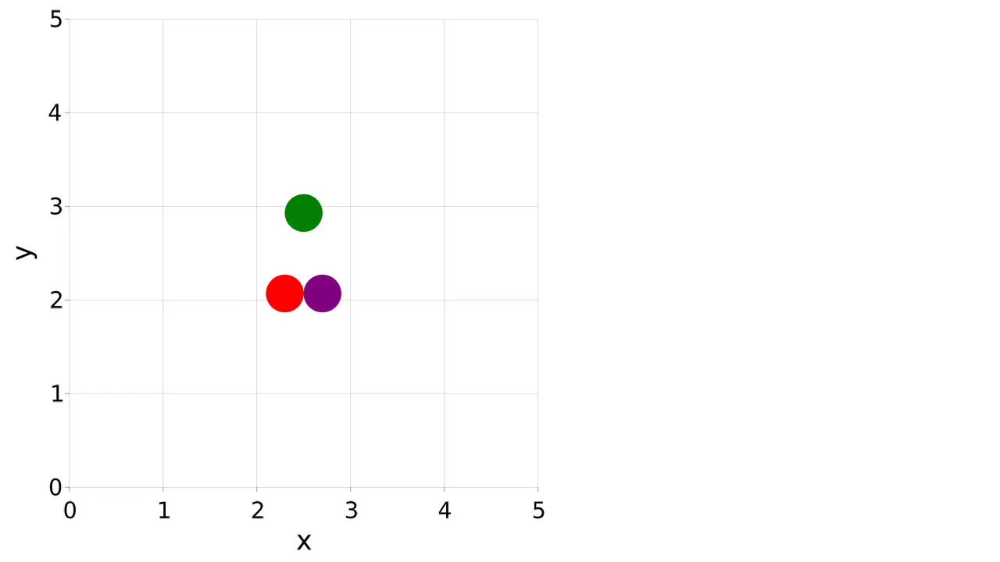

# Differentiable simulation with Molly

!!! note
    There are still many rough edges when taking gradients through simulations. Please open an issue if you run into an error and remember the golden rule of AD: always check your gradients against finite differencing.

In the last few years, the deep learning revolution has broadened to include the paradigm of [differentiable programming](https://en.wikipedia.org/wiki/Differentiable_programming).
The concept of using automatic differentiation (AD) to obtain exact gradients through physical simulations has many interesting applications, including parameterising force fields and training neural networks to describe atomic potentials.

There are some projects that explore differentiable molecular simulations such as [Jax, M.D.](https://github.com/google/jax-md), [TorchMD](https://github.com/torchmd/torchmd) and [mdgrad](https://github.com/torchmd/mdgrad).
However Julia provides a strong suite of AD tools, with [Zygote.jl](https://github.com/FluxML/Zygote.jl) allowing source-to-source transformations for much of the language.
With Molly you can use the power of Zygote to obtain gradients through molecular simulations, even in the presence of complex interactions such as implicit solvation.
Reverse and forward mode AD can be used on the CPU and the GPU.
Pairwise, specific and general interactions work, along with neighbor lists, and the same abstractions for running simulations are used as in the main package.
Differentiable simulation does not currently work with units and some components of the package.

## Pairwise interactions

First, we show how taking gradients through a simulation can be used to optimise an atom property in a [Lennard-Jones](https://en.wikipedia.org/wiki/Lennard-Jones_potential) fluid.
In this type of simulation each atom has a σ value that determines how close it likes to get to other atoms.
We are going to find the σ value that results in a desired distance of each atom to its closest neighbor.
First we need a function to obtain the mean distance of each atom to its closest neighbor:
```julia
using Molly

function mean_min_separation(final_coords, boundary)
    n_atoms = length(final_coords)
    sum_dists = 0.0
    for i in 1:n_atoms
        min_dist = 100.0
        for j in 1:n_atoms
            i == j && continue
            dist = sqrt(sum(abs2, vector(final_coords[i], final_coords[j], boundary)))
            min_dist = min(dist, min_dist)
        end
        sum_dists += min_dist
    end
    return sum_dists / n_atoms
end
```
Now we can set up and run the simulation in a similar way to that described in the [Molly documentation](@ref).
The difference is that we wrap the simulation in a `loss` function.
This returns a single value that we want to obtain gradients with respect to, in this case the value of the above function at the end of the simulation.
The `Zygote.ignore()` block allows us to ignore code for the purposes of obtaining gradients; you could add the [`visualize`](@ref) function there for example.
```julia
using Zygote
using Format

dist_true = 0.5
scale_σ_to_dist = 2 ^ (1 / 6)
σtrue = dist_true / scale_σ_to_dist

n_atoms = 50
n_steps = 500
atom_mass = 10.0
boundary = CubicBoundary(3.0, 3.0, 3.0)
temp = 1.0
neighbor_finder = DistanceVecNeighborFinder(
    nb_matrix=trues(n_atoms, n_atoms),
    n_steps=10,
    dist_cutoff=1.5,
)
lj = LennardJones(nl_only=true, force_units=NoUnits, energy_units=NoUnits)
# Currently required for speed though here it does not affect the simulation
crf = CoulombReactionField(dist_cutoff=1.5, nl_only=true, coulomb_const=0.0,
                           force_units=NoUnits, energy_units=NoUnits)
pairwise_inters = (lj, crf)
coords = place_atoms(n_atoms, boundary, 0.7)
velocities = [velocity(atom_mass, temp) for i in 1:n_atoms]
simulator = VelocityVerlet(
    dt=0.02,
    coupling=RescaleThermostat(temp),
)

function loss(σ)
    atoms = [Atom(0, 0.0, atom_mass, σ, 0.2, false) for i in 1:n_atoms]
    loggers = Dict("coords" => CoordinateLogger(Float64, 10))

    s = System(
        atoms=atoms,
        pairwise_inters=pairwise_inters,
        coords=coords,
        velocities=velocities,
        boundary=boundary,
        neighbor_finder=neighbor_finder,
        loggers=loggers,
        force_units=NoUnits,
        energy_units=NoUnits,
        gpu_diff_safe=true,
    )

    mms_start = mean_min_separation(s.coords, boundary)
    simulate!(s, simulator, n_steps)
    mms_end = mean_min_separation(s.coords, boundary)
    loss_val = abs(mms_end - dist_true)

    Zygote.ignore() do
        printfmt("σ {:6.3f}  |  Mean min sep expected {:6.3f}  |  Mean min sep end {:6.3f}  |  Loss {:6.3f}  |  ",
                  σ, σ * (2 ^ (1 / 6)), mms_end, loss_val)
    end

    return loss_val
end
```
Currently only the combination of `LennardJones` and `CoulombReactionField` or `Coulomb` works on the GPU or fast on the CPU.
Other types work but run slower on the CPU.
This will change in future.

We can obtain the gradient of `loss` with respect to the atom property `σ`.
```julia
grad = gradient(loss, σtrue)[1]
```
This gradient can be used in a training loop to optimise `σ`, starting from an arbitrary value.
```julia
function train()
    σlearn = 0.60 / scale_σ_to_dist
    n_epochs = 15

    for epoch_n in 1:n_epochs
        printfmt("Epoch {:>2}  |  ", epoch_n)
        coords = place_atoms(n_atoms, boundary, 0.7)
        velocities = [velocity(atom_mass, temp) for i in 1:n_atoms]
        grad = gradient(loss, σlearn)[1]
        printfmt("Grad {:6.3f}\n", grad)
        σlearn -= grad * 1e-2
    end
end

train()
```
```
Epoch  1  |  σ  0.535  |  Mean min sep expected  0.600  |  Mean min sep end  0.587  |  Loss  0.087  |  Grad  0.793
Epoch  2  |  σ  0.527  |  Mean min sep expected  0.591  |  Mean min sep end  0.581  |  Loss  0.081  |  Grad  1.202
Epoch  3  |  σ  0.515  |  Mean min sep expected  0.578  |  Mean min sep end  0.568  |  Loss  0.068  |  Grad  1.558
Epoch  4  |  σ  0.499  |  Mean min sep expected  0.560  |  Mean min sep end  0.551  |  Loss  0.051  |  Grad  0.766
Epoch  5  |  σ  0.491  |  Mean min sep expected  0.552  |  Mean min sep end  0.543  |  Loss  0.043  |  Grad  1.068
Epoch  6  |  σ  0.481  |  Mean min sep expected  0.540  |  Mean min sep end  0.531  |  Loss  0.031  |  Grad  0.757
Epoch  7  |  σ  0.473  |  Mean min sep expected  0.531  |  Mean min sep end  0.526  |  Loss  0.026  |  Grad  0.781
Epoch  8  |  σ  0.465  |  Mean min sep expected  0.522  |  Mean min sep end  0.518  |  Loss  0.018  |  Grad  1.549
Epoch  9  |  σ  0.450  |  Mean min sep expected  0.505  |  Mean min sep end  0.504  |  Loss  0.004  |  Grad  0.030
Epoch 10  |  σ  0.450  |  Mean min sep expected  0.505  |  Mean min sep end  0.504  |  Loss  0.004  |  Grad  0.066
Epoch 11  |  σ  0.449  |  Mean min sep expected  0.504  |  Mean min sep end  0.503  |  Loss  0.003  |  Grad  0.313
Epoch 12  |  σ  0.446  |  Mean min sep expected  0.500  |  Mean min sep end  0.501  |  Loss  0.001  |  Grad  0.636
Epoch 13  |  σ  0.439  |  Mean min sep expected  0.493  |  Mean min sep end  0.497  |  Loss  0.003  |  Grad -0.181
Epoch 14  |  σ  0.441  |  Mean min sep expected  0.495  |  Mean min sep end  0.498  |  Loss  0.002  |  Grad -0.758
Epoch 15  |  σ  0.449  |  Mean min sep expected  0.504  |  Mean min sep end  0.503  |  Loss  0.003  |  Grad  0.281
```
The final value we get is 0.449, close to the theoretical value of 0.445 if all atoms have a neighbor at the minimum pairwise energy distance.
The RDF looks as follows, with the purple line corresponding to the desired distance to the closest neighbor.


It is common to require a loss function formed from values throughout a simulation.
In this case it is recommended to split up the simulation into a set of short simulations, each starting from the previous final coordinates and velocities.
This runs the same simulation but makes the intermediate coordinates and velocities available for use in the loss function.
It is recommended to have a single value to accumulate values of the loss function.
For example, the RMSD could be calculated from the coordinates every 100 steps and added to a variable that is then divided by the number of chunks to get a loss value corresponding to the mean RMSD over the simulation.
Loggers are ignored for gradient calculation and should not be used in the loss function.

## Specific interactions

Next we look at obtaining gradients through simulations with specific interactions, e.g. bonds or angles between specified atoms.
We will simulate two triatomic molecules and search for a minimum energy bond angle that gives a desired distance between the atoms at the end of the simulation.
```julia
using Molly
using Zygote
using Format
using LinearAlgebra

dist_true = 1.0

n_steps = 150
atom_mass = 10.0
boundary = CubicBoundary(3.0, 3.0, 3.0)
temp = 0.05
coords = [
    SVector(0.8, 0.75, 1.5), SVector(1.5, 0.70, 1.5), SVector(2.3, 0.75, 1.5),
    SVector(0.8, 2.25, 1.5), SVector(1.5, 2.20, 1.5), SVector(2.3, 2.25, 1.5),
]
n_atoms = length(coords)
velocities = zero(coords)
simulator = VelocityVerlet(
    dt=0.05,
    coupling=BerendsenThermostat(temp, 0.5),
)

function loss(θ)
    atoms = [Atom(0, 0.0, atom_mass, 0.0, 0.0, false) for i in 1:n_atoms]
    loggers = Dict("coords" => CoordinateLogger(Float64, 2))
    specific_inter_lists = (
        InteractionList2Atoms(
            [1, 2, 4, 5],
            [2, 3, 5, 6],
            ["", "", "", ""],
            [HarmonicBond(0.7, 100.0) for _ in 1:4],
        ),
        InteractionList3Atoms(
            [1, 4],
            [2, 5],
            [3, 6],
            ["", ""],
            [HarmonicAngle(θ, 10.0), HarmonicAngle(θ, 10.0)],
        ),
    )

    s = System(
        atoms=atoms,
        specific_inter_lists=specific_inter_lists,
        coords=deepcopy(coords),
        velocities=deepcopy(velocities),
        boundary=boundary,
        loggers=loggers,
        force_units=NoUnits,
        energy_units=NoUnits,
        gpu_diff_safe=true,
    )

    simulate!(s, simulator, n_steps)

    d1 = norm(vector(s.coords[1], s.coords[3], boundary))
    d2 = norm(vector(s.coords[4], s.coords[6], boundary))
    dist_end = 0.5 * (d1 + d2)
    loss_val = abs(dist_end - dist_true)

    Zygote.ignore() do
        printfmt("θ {:5.1f}°  |  Final dist {:4.2f}  |  Loss {:5.3f}  |  ",
                 rad2deg(θ), dist_end, loss_val)
    end

    return loss_val
end

function train()
    θlearn = deg2rad(110.0)
    n_epochs = 20

    for epoch_n in 1:n_epochs
        printfmt("Epoch {:>2}  |  ", epoch_n)
        grad = gradient(loss, θlearn)[1]
        printfmt("Grad {:6.3f}\n", round(grad; digits=2))
        θlearn -= grad * 0.1
    end
end

train()
```
```
Epoch  1  |  θ 110.0°  |  Final dist 1.16  |  Loss 0.155  |  Grad  0.410
Epoch  2  |  θ 107.7°  |  Final dist 1.14  |  Loss 0.138  |  Grad  0.430
Epoch  3  |  θ 105.2°  |  Final dist 1.12  |  Loss 0.119  |  Grad  0.450
Epoch  4  |  θ 102.6°  |  Final dist 1.10  |  Loss 0.099  |  Grad  0.470
Epoch  5  |  θ 100.0°  |  Final dist 1.08  |  Loss 0.077  |  Grad  0.490
Epoch  6  |  θ  97.2°  |  Final dist 1.05  |  Loss 0.049  |  Grad  0.710
Epoch  7  |  θ  93.1°  |  Final dist 1.01  |  Loss 0.012  |  Grad  0.520
Epoch  8  |  θ  90.1°  |  Final dist 0.98  |  Loss 0.015  |  Grad -0.540
Epoch  9  |  θ  93.2°  |  Final dist 1.01  |  Loss 0.013  |  Grad  0.520
Epoch 10  |  θ  90.2°  |  Final dist 0.99  |  Loss 0.015  |  Grad -0.540
Epoch 11  |  θ  93.3°  |  Final dist 1.01  |  Loss 0.014  |  Grad  0.520
Epoch 12  |  θ  90.3°  |  Final dist 0.99  |  Loss 0.014  |  Grad -0.540
Epoch 13  |  θ  93.4°  |  Final dist 1.01  |  Loss 0.015  |  Grad  0.520
Epoch 14  |  θ  90.4°  |  Final dist 0.99  |  Loss 0.013  |  Grad -0.540
Epoch 15  |  θ  93.5°  |  Final dist 1.02  |  Loss 0.016  |  Grad  0.520
Epoch 16  |  θ  90.5°  |  Final dist 0.99  |  Loss 0.012  |  Grad -0.540
Epoch 17  |  θ  93.6°  |  Final dist 1.02  |  Loss 0.016  |  Grad  0.520
Epoch 18  |  θ  90.6°  |  Final dist 0.99  |  Loss 0.011  |  Grad -0.530
Epoch 19  |  θ  93.7°  |  Final dist 1.02  |  Loss 0.017  |  Grad  0.520
Epoch 20  |  θ  90.7°  |  Final dist 0.99  |  Loss 0.010  |  Grad -0.530
```
The final value we get is 90.7°, close to the theoretical value of 91.2° which can be calculated with trigonometry.
The final simulation looks like this:

In the presence of other forces this value would not be so trivially obtainable.
We can record the gradients for different values of `θ`:
```julia
θs = collect(0:3:180)[2:end]
grads = [gradient(loss, deg2rad(θ))[1] for θ in θs]
```
The plot of these shows that the gradient has the expected sign either side of the correct value.


## Neural network potentials

Since gradients can be computed with Zygote, [Flux](https://fluxml.ai) models can also be incorporated into simulations.
Here we show a neural network in the force function, though they can also be used in other parts of the simulation.
This example also shows how gradients for multiple parameters can be obtained, in this case the parameters of the neural network.
The jump from single to multiple parameters is important because single parameters can be easily optimised using other approaches, whereas differentiable simulation is well-placed to optimise many parameters simultaneously.

We set up three pseudo-atoms and train a network to imitate the Julia logo by moving the bottom two atoms:
```julia
using Molly
using Zygote
using Flux
using Format
using LinearAlgebra

dist_true = 1.0f0

model = Chain(
    Dense(1, 5, relu),
    Dense(5, 1, tanh),
)
ps = params(model)

struct NNBond <: SpecificInteraction end

function Molly.force(b::NNBond, coords_i, coords_j, boundary)
    vec_ij = vector(coords_i, coords_j, boundary)
    dist = norm(vec_ij)
    f = model([dist])[1] * normalize(vec_ij)
    return SpecificForce2Atoms(f, -f)
end

n_steps = 400
mass = 10.0f0
boundary = CubicBoundary(5.0f0, 5.0f0, 5.0f0)
temp = 0.01f0
coords = [
    SVector(2.3f0, 2.07f0, 0.0f0),
    SVector(2.5f0, 2.93f0, 0.0f0),
    SVector(2.7f0, 2.07f0, 0.0f0),
]
n_atoms = length(coords)
velocities = zero(coords)
simulator = VelocityVerlet(
    dt=0.02f0,
    coupling=BerendsenThermostat(temp, 0.5f0),
)

function loss()
    atoms = [Atom(0, 0.0f0, mass, 0.0f0, 0.0f0, false) for i in 1:n_atoms]
    loggers = Dict("coords" => CoordinateLogger(Float32, 10))
    specific_inter_lists = (
        InteractionList2Atoms([1], [3], [""], [NNBond()]),
    )

    s = System(
        atoms=atoms,
        specific_inter_lists=specific_inter_lists,
        coords=deepcopy(coords),
        velocities=deepcopy(velocities),
        boundary=boundary,
        loggers=loggers,
        force_units=NoUnits,
        energy_units=NoUnits,
        gpu_diff_safe=true,
    )

    simulate!(s, simulator, n_steps)

    dist_end = (norm(vector(s.coords[1], s.coords[2], boundary)) +
                norm(vector(s.coords[2], s.coords[3], boundary)) +
                norm(vector(s.coords[3], s.coords[1], boundary))) / 3
    loss_val = abs(dist_end - dist_true)

    Zygote.ignore() do
        printfmt("Dist end {:6.3f}  |  Loss {:6.3f}\n", dist_end, loss_val)
        visualize(s.loggers["coords"], boundary, "sim.mp4")
    end

    return loss_val
end
```
Before training the result looks like this:

```julia
function train()
    n_epochs = 20
    opt = ADAM(0.02, (0.9, 0.999))

    for epoch_n in 1:n_epochs
        printfmt("Epoch {:>2}  |  ", epoch_n)
        Flux.train!(loss, ps, ((),), opt)
    end
end

train()
```
```
Epoch  1  |  Dist end  0.757  |  Loss  0.243
Epoch  2  |  Dist end  0.773  |  Loss  0.227
Epoch  3  |  Dist end  0.794  |  Loss  0.206
Epoch  4  |  Dist end  0.817  |  Loss  0.183
Epoch  5  |  Dist end  0.843  |  Loss  0.157
Epoch  6  |  Dist end  0.870  |  Loss  0.130
Epoch  7  |  Dist end  0.898  |  Loss  0.102
Epoch  8  |  Dist end  0.927  |  Loss  0.073
Epoch  9  |  Dist end  0.957  |  Loss  0.043
Epoch 10  |  Dist end  0.988  |  Loss  0.012
Epoch 11  |  Dist end  1.018  |  Loss  0.018
Epoch 12  |  Dist end  1.038  |  Loss  0.038
Epoch 13  |  Dist end  1.050  |  Loss  0.050
Epoch 14  |  Dist end  1.055  |  Loss  0.055
Epoch 15  |  Dist end  1.054  |  Loss  0.054
Epoch 16  |  Dist end  1.049  |  Loss  0.049
Epoch 17  |  Dist end  1.041  |  Loss  0.041
Epoch 18  |  Dist end  1.030  |  Loss  0.030
Epoch 19  |  Dist end  1.017  |  Loss  0.017
Epoch 20  |  Dist end  1.003  |  Loss  0.003
```
After training it looks much better:

You could replace the simple network here with a much more complicated model and it would theoretically be able to train, even if it might prove practically difficult (see discussion below).

## Molecular loss functions

Ultimately, you need some objective function in order to calculate the gradient for each parameter.
Here are some ideas for loss functions suitable for differentiable molecular simulations:
- The distance between atoms at the end of the simulation compared to some reference state. This loss is used in the examples given here, is physically reasonable, and has obvious bounds.
- The distance between atoms throughout the simulation.
- The radial distribution function of atoms.
- RMSD between atoms and a reference state - this would be suitable for macromolecules.
- dRMSD, the distance between a distance map and a reference distance map.
- The radius of gyration of a molecule.
- The flexibility of a set of atoms over the simulation.
- Supramolecular geometry, for example assembly of molecules into straight fibres.
- The correlation of different velocities over the simulation.
- The energy of the system.
- The temperature of the system.
- Some measure of phase change or a critical point.
- A combination of the above, for example to obtain a force field relevant to both ordered and disordered proteins.
Some of these are currently not possible in Molly as the loggers are ignored for gradient purposes, but this will hopefully change in future.

## Tips and tricks

- The magnitude of gradients may be less important than the sign. Consider sampling gradients across different sources of stochasticity, such as starting velocities and conformations.
- Exploding gradients prove a problem when using the velocity Verlet integrator in the NVE ensemble. This is why the velocity rescaling and Berendsen thermostats were used in the above examples. It is likely that the development of suitable simulation strategies and thermostats will be necessary to unlock the potential of differentiable simulation.
- Do you *really* need a neural network to describe your potential? Think about learning a smaller number of physically-meaningful parameters before you put in a large neural network and expect it to learn. Whilst it is true that neural networks are universal function approximators, it does not follow that you will be able to train one by differentiating through  a long simulation. A 1,000-step simulation with a 10-layer network at each step is analogous to training a 10,000 layer network (with shared weights).
- Forward mode AD holds much promise for differentiable simulation, provided that the number of parameters is small, because the memory requirement is constant in the number of simulation steps. However, if the code runs slower than non-differentiable alternatives then the best approach is likely to use finite differencing with the simulation as a black box.
