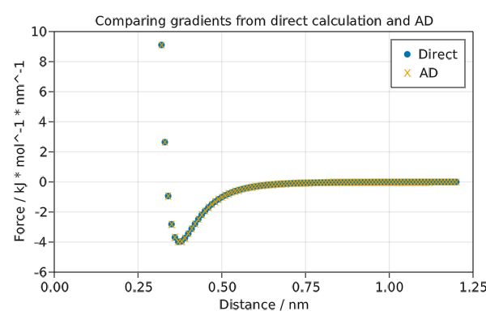

# Molly examples

The best examples for learning how the package works are in the [Molly documentation](@ref) section.
Here we give further examples, showing what you can do with the package.
Each is a self-contained block of code.
Made something cool yourself?
Make a PR to add it to this page.

## Making and breaking bonds

There is an example of mutable atom properties in the main docs, but what if you want to make and break bonds during the simulation?
In this case you can use a `GeneralInteraction` to make, break and apply the bonds.
The partners of the atom can be stored in the atom type.
We make a logger to record when the bonds are present, allowing us to visualize them with the `connection_frames` keyword argument to `visualize` (this can take a while to plot).
```julia
using Molly
using GLMakie
using LinearAlgebra

struct BondableAtom
    i::Int
    mass::Float64
    σ::Float64
    ϵ::Float64
    partners::Set{Int}
end

Molly.mass(ba::BondableAtom) = ba.mass

struct BondableInteraction <: GeneralInteraction
    nl_only::Bool
    prob_formation::Float64
    prob_break::Float64
    dist_formation::Float64
    b0::Float64
    kb::Float64
end

function Molly.force(inter::BondableInteraction,
                        coord_i,
                        coord_j,
                        atom_i,
                        atom_j,
                        box_size)
    # Break bonds randomly
    if atom_j.i in atom_i.partners && rand() < inter.prob_break
        delete!(atom_i.partners, atom_j.i)
        delete!(atom_j.partners, atom_j.i)
    end
    # Make bonds between close atoms randomly
    dr = vector(coord_i, coord_j, box_size)
    r2 = sum(abs2, dr)
    if r2 < inter.b0 * inter.dist_formation && rand() < inter.prob_formation
        push!(atom_i.partners, atom_j.i)
        push!(atom_j.partners, atom_j.i)
    end
    # Apply the force of a harmonic bond
    if atom_j.i in atom_i.partners
        c = inter.kb * (norm(dr) - inter.b0)
        fdr = -c * normalize(dr)
        return fdr
    else
        return zero(coord_i)
    end
end

struct BondLogger <: Logger
    n_steps::Int
    bonds::Vector{BitVector}
end

function Molly.log_property!(logger::BondLogger, s, neighbors, step_n)
    if step_n % logger.n_steps == 0
        bonds = BitVector()
        for i in 1:length(s)
            for j in 1:(i - 1)
                push!(bonds, j in s.atoms[i].partners)
            end
        end
        push!(logger.bonds, bonds)
    end
end

n_atoms = 200
box_size = SVector(10.0, 10.0)
n_steps = 2_000
temp = 0.01

atoms = [BondableAtom(i, 1.0, 0.1, 0.02, Set([])) for i in 1:n_atoms]
coords = place_atoms(n_atoms, box_size, 0.1)
velocities = [velocity(1.0, temp; dims=2) for i in 1:n_atoms]
general_inters = (SoftSphere(nl_only=true), BondableInteraction(true, 0.1, 0.1, 1.1, 0.1, 2.0))
neighbor_finder = DistanceNeighborFinder(nb_matrix=trues(n_atoms, n_atoms), n_steps=10, dist_cutoff=2.0)
simulator = VelocityVerlet(dt=0.02, coupling=AndersenThermostat(temp, 5.0))

sys = System(
    atoms=atoms,
    general_inters=general_inters,
    coords=coords,
    velocities=velocities,
    box_size=box_size,
    neighbor_finder=neighbor_finder,
    loggers=Dict("coords" => CoordinateLogger(Float64, 20; dims=2),
                    "bonds" => BondLogger(20, [])),
    force_unit=NoUnits,
    energy_unit=NoUnits,
)

simulate!(sys, simulator, n_steps)

connections = Tuple{Int, Int}[]
for i in 1:length(sys)
    for j in 1:(i - 1)
        push!(connections, (i, j))
    end
end

visualize(sys.loggers["coords"],
            box_size,
            "sim_mutbond.mp4";
            connections=connections,
            connection_frames=sys.loggers["bonds"].bonds,
            markersize=10.0)
```


## Comparing direct forces to AD

The force is the negative derivative of the potential energy with respect to position.
MD packages including Molly usually implement the force functions directly for performance.
However it is also possible to compute the forces using AD.
Here we compare the two approaches for the Lennard-Jones potential and see that they give the same result.
```julia
using Molly
using Zygote
using GLMakie

inter = LennardJones(force_unit=NoUnits, energy_unit=NoUnits)
box_size = SVector(5.0, 5.0, 5.0)
a1, a2 = Atom(σ=0.3, ϵ=0.5), Atom(σ=0.3, ϵ=0.5)

function force_direct(dist)
    F = force(inter, SVector(1.0, 1.0, 1.0), SVector(dist + 1.0, 1.0, 1.0), a1, a2, box_size)
    return F[1]
end

function force_grad(dist)
    grad = gradient(dist) do dist
        potential_energy(inter, SVector(1.0, 1.0, 1.0), SVector(dist + 1.0, 1.0, 1.0), a1, a2, box_size)
    end
    return -grad[1]
end

dists = collect(0.2:0.01:1.2)
forces_direct = force_direct.(dists)
forces_grad = force_grad.(dists)

f = Figure(resolution=(600, 400))
ax = Axis(f[1, 1], xlabel="Distance / nm", ylabel="Force / kJ * mol^-1 * nm^-1",
            title="Comparing gradients from direct calculation and AD")
scatter!(ax, dists, forces_direct, label="Direct", markersize=8)
scatter!(ax, dists, forces_grad  , label="AD"    , markersize=8, marker='x')
xlims!(ax, low=0)
ylims!(ax, -6.0, 10.0)
axislegend()
save("force_comparison.png", f)
```

