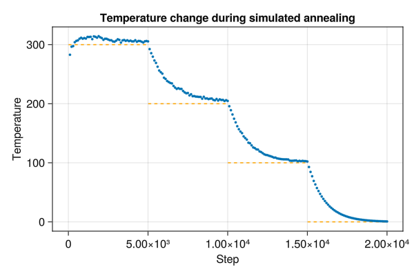
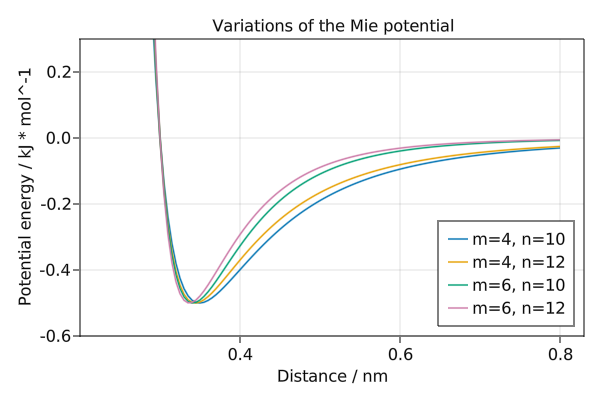
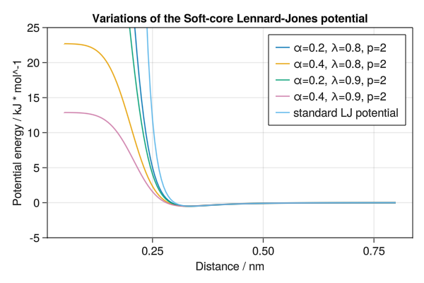

# Molly examples

The best examples for learning how the package works are in the [Molly documentation](@ref) section.
Here we give further examples showing what you can do with the package.
Each is a self-contained block of code.
Made something cool yourself?
Make a PR to add it to this page.

## Simulated annealing

You can change the thermostat temperature of a simulation by changing the simulator.
Here we reduce the temperature of a simulation in stages from 300 K to 0 K.
```julia
using Molly
using GLMakie

data_dir = joinpath(dirname(pathof(Molly)), "..", "data")
ff = OpenMMForceField(
    joinpath(data_dir, "force_fields", "ff99SBildn.xml"),
    joinpath(data_dir, "force_fields", "tip3p_standard.xml"),
    joinpath(data_dir, "force_fields", "his.xml"),
)

sys = System(
    joinpath(data_dir, "6mrr_equil.pdb"),
    ff;
    loggers=(temp=TemperatureLogger(100),),
)

minimizer = SteepestDescentMinimizer()
simulate!(sys, minimizer)

temps = [300.0, 200.0, 100.0, 0.0]u"K"
random_velocities!(sys, temps[1])

for temp in temps
    simulator = Langevin(
        dt=0.001u"ps",
        temperature=temp,
        friction=1.0u"ps^-1",
    )
    simulate!(sys, simulator, 5_000)
end

f = Figure(resolution=(600, 400))
ax = Axis(
    f[1, 1],
    xlabel="Step",
    ylabel="Temperature",
    title="Temperature change during simulated annealing",
)
for (i, temp) in enumerate(temps)
    lines!(
        ax,
        [5100 * i - 5000, 5100 * i],
        [ustrip(temp), ustrip(temp)],
        linestyle="--",
        color=:orange,
    )
end
scatter!(
    ax,
    100 .* (1:length(values(sys.loggers.temp))),
    ustrip.(values(sys.loggers.temp)),
    markersize=5,
)
save("annealing.png", f)
```


## Solar system

Orbits of the four closest planets to the sun can be simulated.
```julia
using Molly
using GLMakie

# Using get_body_barycentric_posvel from Astropy
coords = [
    SVector(-1336052.8665050615,  294465.0896030796 ,  158690.88781384667)u"km",
    SVector(-58249418.70233503 , -26940630.286818042, -8491250.752464907 )u"km",
    SVector( 58624128.321813114, -81162437.2641475  , -40287143.05760552 )u"km",
    SVector(-99397467.7302648  , -105119583.06486066, -45537506.29775053 )u"km",
    SVector( 131714235.34070954, -144249196.60814604, -69730238.5084304  )u"km",
]

velocities = [
    SVector(-303.86327859262457, -1229.6540090943934, -513.791218405548  )u"km * d^-1",
    SVector( 1012486.9596885007, -3134222.279236384 , -1779128.5093088674)u"km * d^-1",
    SVector( 2504563.6403826815,  1567163.5923297722,  546718.234192132  )u"km * d^-1",
    SVector( 1915792.9709661514, -1542400.0057833872, -668579.962254351  )u"km * d^-1",
    SVector( 1690083.43357355  ,  1393597.7855017239,  593655.0037930267 )u"km * d^-1",
]

body_masses = [
    1.989e30u"kg",
    0.330e24u"kg",
    4.87e24u"kg" ,
    5.97e24u"kg" ,
    0.642e24u"kg",
]

boundary = CubicBoundary(1e9u"km")

# Convert the gravitational constant to the appropriate units
inter = Gravity(G=convert(typeof(1.0u"km^3 * kg^-1 * d^-2"), Unitful.G))

sys = System(
    atoms=[Atom(mass=m) for m in body_masses],
    pairwise_inters=(inter,),
    coords=coords .+ (SVector(5e8, 5e8, 5e8)u"km",),
    velocities=velocities,
    boundary=boundary,
    loggers=(coords=CoordinateLogger(typeof(1.0u"km"), 10),),
    force_units=u"kg * km * d^-2",
    energy_units=u"kg * km^2 * d^-2",
)

simulator = Verlet(
    dt=0.1u"d",
    remove_CM_motion=false,
)

simulate!(sys, simulator, 3650) # 1 year

visualize(
    sys.loggers.coords,
    boundary,
    "sim_planets.mp4";
    trails=5,
    color=[:yellow, :grey, :orange, :blue, :red],
    markersize=[0.25, 0.08, 0.08, 0.08, 0.08],
    transparency=false,
)
```


## Making and breaking bonds

There is an example of mutable atom properties in the main documentation, but what if you want to make and break bonds during the simulation?
In this case you can use a [`PairwiseInteraction`](@ref) to make, break and apply the bonds.
The partners of the atom can be stored in the atom type.
We make a logger to record when the bonds are present, allowing us to visualize them with the `connection_frames` keyword argument to [`visualize`](@ref) (this can take a while to plot).
```julia
using Molly
using GLMakie
using LinearAlgebra

struct BondableAtom
    i::Int
    mass::Float64
    σ::Float64
    ϵ::Float64
    partners::Set{Int}
end

struct BondableInteraction <: PairwiseInteraction
    nl_only::Bool
    prob_formation::Float64
    prob_break::Float64
    dist_formation::Float64
    k::Float64
    r0::Float64
end

function Molly.force(inter::BondableInteraction,
                        dr,
                        coord_i,
                        coord_j,
                        atom_i,
                        atom_j,
                        boundary)
    # Break bonds randomly
    if atom_j.i in atom_i.partners && rand() < inter.prob_break
        delete!(atom_i.partners, atom_j.i)
        delete!(atom_j.partners, atom_i.i)
    end
    # Make bonds between close atoms randomly
    r2 = sum(abs2, dr)
    if r2 < inter.r0 * inter.dist_formation && rand() < inter.prob_formation
        push!(atom_i.partners, atom_j.i)
        push!(atom_j.partners, atom_i.i)
    end
    # Apply the force of a harmonic bond
    if atom_j.i in atom_i.partners
        c = inter.k * (norm(dr) - inter.r0)
        fdr = -c * normalize(dr)
        return fdr
    else
        return zero(coord_i)
    end
end

function bonds(sys::System, neighbors=nothing, n_threads::Integer=Threads.nthreads())
    bonds = BitVector()
    for i in 1:length(sys)
        for j in 1:(i - 1)
            push!(bonds, j in sys.atoms[i].partners)
        end
    end
    return bonds
end

BondLogger(n_steps) = GeneralObservableLogger(bonds, BitVector, n_steps)

n_atoms = 200
boundary = RectangularBoundary(10.0)
n_steps = 2_000
temp = 1.0

atoms = [BondableAtom(i, 1.0, 0.1, 0.02, Set([])) for i in 1:n_atoms]
coords = place_atoms(n_atoms, boundary; min_dist=0.1)
velocities = [velocity(1.0, temp; dims=2) for i in 1:n_atoms]
pairwise_inters = (
    SoftSphere(nl_only=true),
    BondableInteraction(true, 0.1, 0.1, 1.1, 2.0, 0.1),
)
neighbor_finder = DistanceNeighborFinder(
    nb_matrix=trues(n_atoms, n_atoms),
    n_steps=10,
    dist_cutoff=2.0,
)
simulator = VelocityVerlet(
    dt=0.02,
    coupling=AndersenThermostat(temp, 5.0),
)

sys = System(
    atoms=atoms,
    pairwise_inters=pairwise_inters,
    coords=coords,
    velocities=velocities,
    boundary=boundary,
    neighbor_finder=neighbor_finder,
    loggers=(
        coords=CoordinateLogger(Float64, 20; dims=2),
        bonds=BondLogger(20),
    ),
    force_units=NoUnits,
    energy_units=NoUnits,
)

simulate!(sys, simulator, n_steps)

connections = Tuple{Int, Int}[]
for i in 1:length(sys)
    for j in 1:(i - 1)
        push!(connections, (i, j))
    end
end

visualize(
    sys.loggers.coords,
    boundary,
    "sim_mutbond.mp4";
    connections=connections,
    connection_frames=values(sys.loggers.bonds),
    markersize=0.1,
)
```


## Comparing forces to AD

The force is the negative derivative of the potential energy with respect to position.
MD packages, including Molly, implement the force functions directly for performance.
However it is also possible to compute the forces using AD.
Here we compare the two approaches for the Lennard-Jones potential and see that they give the same result.
```julia
using Molly
using Zygote
using GLMakie

inter = LennardJones(force_units=NoUnits, energy_units=NoUnits)
boundary = CubicBoundary(5.0)
a1, a2 = Atom(σ=0.3, ϵ=0.5), Atom(σ=0.3, ϵ=0.5)

function force_direct(dist)
    c1 = SVector(1.0, 1.0, 1.0)
    c2 = SVector(dist + 1.0, 1.0, 1.0)
    vec = vector(c1, c2, boundary)
    F = force(inter, vec, c1, c2, a1, a2, boundary)
    return F[1]
end

function force_grad(dist)
    grad = gradient(dist) do dist
        c1 = SVector(1.0, 1.0, 1.0)
        c2 = SVector(dist + 1.0, 1.0, 1.0)
        vec = vector(c1, c2, boundary)
        potential_energy(inter, vec, c1, c2, a1, a2, boundary)
    end
    return -grad[1]
end

dists = collect(0.2:0.01:1.2)
forces_direct = force_direct.(dists)
forces_grad = force_grad.(dists)

f = Figure(resolution=(600, 400))
ax = Axis(
    f[1, 1],
    xlabel="Distance / nm",
    ylabel="Force / kJ * mol^-1 * nm^-1",
    title="Comparing gradients from direct calculation and AD",
)
scatter!(ax, dists, forces_direct, label="Direct", markersize=8)
scatter!(ax, dists, forces_grad  , label="AD"    , markersize=8, marker='x')
xlims!(ax, low=0)
ylims!(ax, -6.0, 10.0)
axislegend()
save("force_comparison.png", f)
```


## Variations of the Morse potential

The Morse potential for bonds has a parameter *a* that determines the width of the potential.
It can also be compared to the harmonic bond potential.
```julia
using Molly
using GLMakie

boundary = CubicBoundary(5.0)
dists = collect(0.12:0.005:2.0)

function energies(inter)
    return map(dists) do dist
        c1 = SVector(1.0, 1.0, 1.0)
        c2 = SVector(dist + 1.0, 1.0, 1.0)
        potential_energy(inter, c1, c2, boundary)
    end
end

f = Figure(resolution=(600, 400))
ax = Axis(
    f[1, 1],
    xlabel="Distance / nm",
    ylabel="Potential energy / kJ * mol^-1",
    title="Variations of the Morse potential",
)
lines!(
    ax,
    dists,
    energies(HarmonicBond(k=20_000.0, r0=0.2)),
    label="Harmonic",
)
for a in [2.5, 5.0, 10.0]
    lines!(
        ax,
        dists,
        energies(MorseBond(D=100.0, a=a, r0=0.2)),
        label="Morse a=$a nm^-1",
    )
end
ylims!(ax, 0.0, 120.0)
axislegend(position=:rb)
save("morse.png", f)
```


## Variations of the Mie potential

The Mie potential is parameterised by *m* describing the attraction and *n* describing the repulsion.
When *m*=6 and *n*=12 this is equivalent to the Lennard-Jones potential.
```julia
using Molly
using GLMakie

boundary = CubicBoundary(5.0)
a1, a2 = Atom(σ=0.3, ϵ=0.5), Atom(σ=0.3, ϵ=0.5)
dists = collect(0.2:0.005:0.8)

function energies(m, n)
    inter = Mie(m=m, n=n)
    return map(dists) do dist
        c1 = SVector(1.0, 1.0, 1.0)
        c2 = SVector(dist + 1.0, 1.0, 1.0)
        vec = vector(c1, c2, boundary)
        potential_energy(inter, vec, c1, c2, a1, a2, boundary)
    end
end

f = Figure(resolution=(600, 400))
ax = Axis(
    f[1, 1],
    xlabel="Distance / nm",
    ylabel="Potential energy / kJ * mol^-1",
    title="Variations of the Mie potential",
)
for m in [4, 6]
    for n in [10, 12]
        lines!(
            ax,
            dists,
            energies(Float64(m), Float64(n)),
            label="m=$m, n=$n",
        )
    end
end
xlims!(ax, low=0.2)
ylims!(ax, -0.6, 0.3)
axislegend(position=:rb)
save("mie.png", f)
```


## Variations of the soft-core LJ potential

The soft-core Lennard-Jones potential is parameterised by three parameters ``\alpha``, ``\lambda`` and ``p``.
These parameters shift the value of ``r_{ij}`` to ``\left(r_{ij}^6 + \sigma_{ij} \alpha \lambda^{p} \right)^{\frac{1}{6}}``.
This gives a soft core, i.e. the potential does not diverge for ``r_{ij} \rightarrow 0``.
```julia
using Molly
using GLMakie

boundary = CubicBoundary(5.0)
a1, a2 = Atom(σ=0.3, ϵ=0.5), Atom(σ=0.3, ϵ=0.5)
dists = collect(0.05:0.005:0.8)

function energies(α, λ, p)
    inter = LennardJonesSoftCore(α=α, λ=λ, p=p)
    return map(dists) do dist
        c1 = SVector(1.0, 1.0, 1.0)
        c2 = SVector(dist + 1.0, 1.0, 1.0)
        vec = vector(c1, c2, boundary)
        potential_energy(inter, vec, c1, c2, a1, a2, boundary)
    end
end

f = Figure(resolution=(600, 400))
ax = Axis(
    f[1, 1],
    xlabel="Distance / nm",
    ylabel="Potential energy / kJ * mol^-1",
    title="Variations of the soft-core Lennard-Jones potential",
)
for λ in [0.8, 0.9]
    for α in [0.2, 0.4]
        for p in [2]
            lines!(
                ax,
                dists,
                energies(α, λ, p),
                label="α=$α, λ=$λ, p=$p",
            )
        end
    end
end

lines!(ax, dists, energies(0, 1, 2), label="standard LJ potential")

ylims!(-5, 25)
axislegend(position=:rt)
save("lennard_jones_sc.png", f)
```


The form of the potential is approximately the same as standard Lennard-Jones for ``r_{ij} > \sigma_{ij}`` if some fractional values are used for ``\lambda`` and ``\alpha``.
